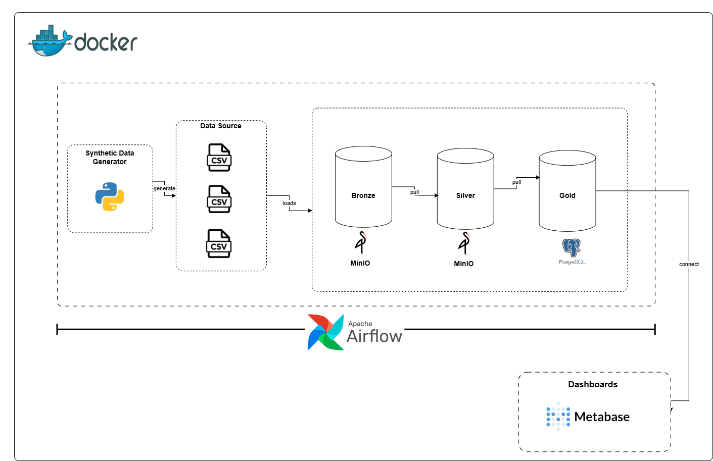
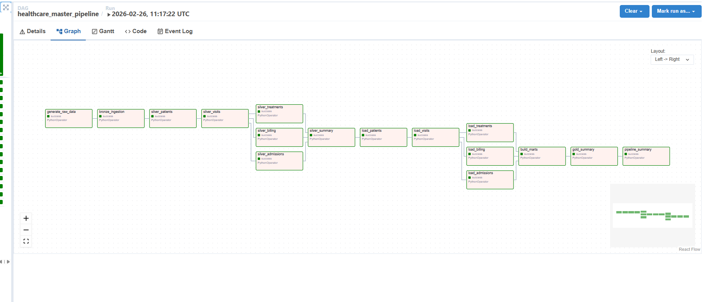
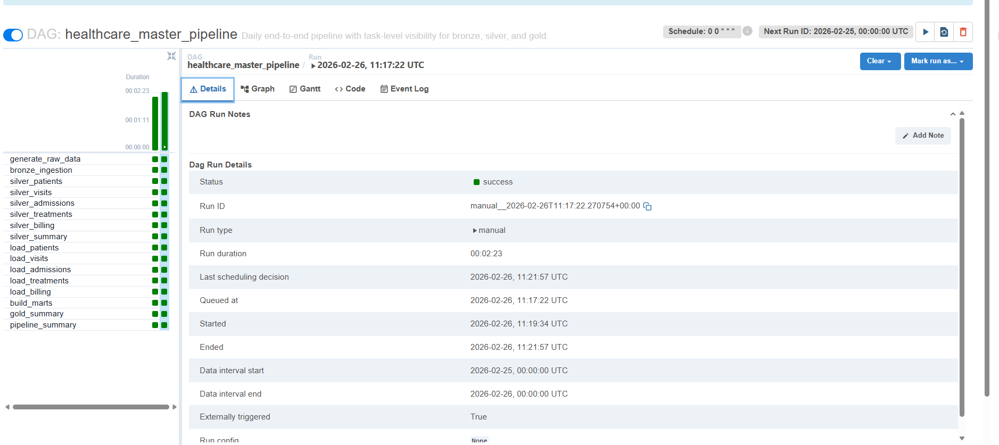
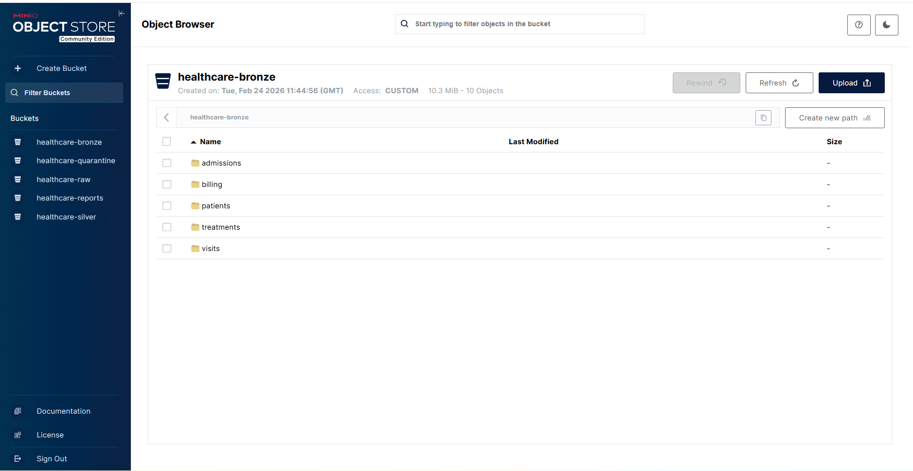
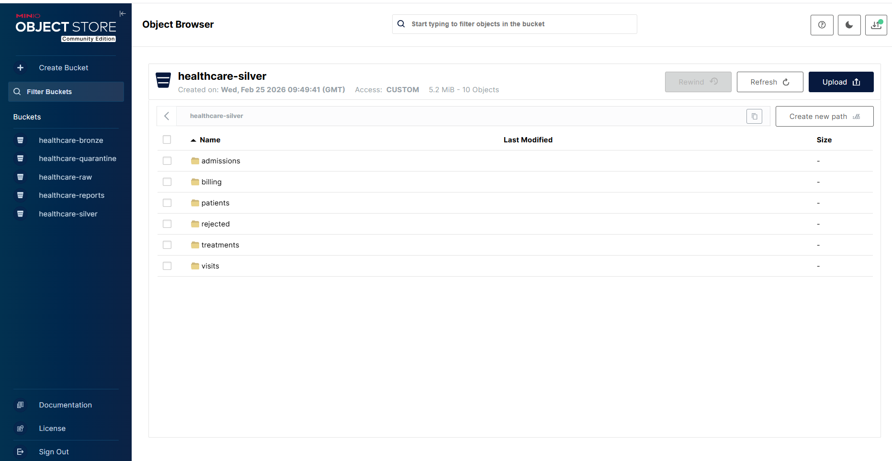
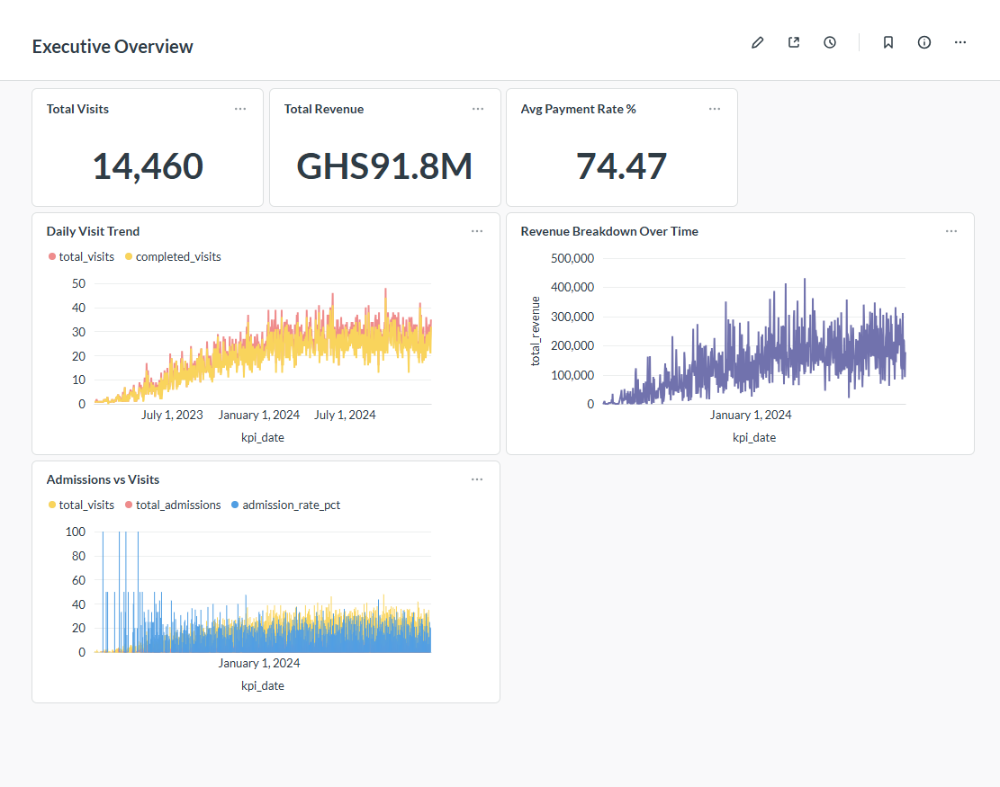
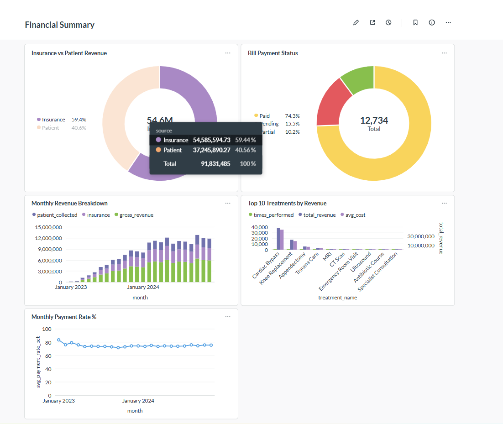
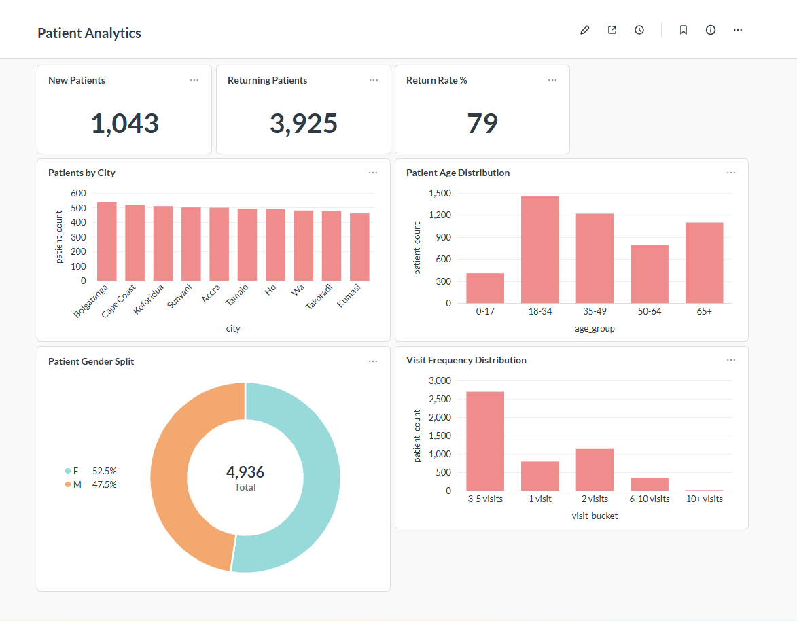

# Healthcare Operations and Patient Flow Analytics Platform

## Project Overview
Healthcare facilities generate large volumes of operational data every day — patient registrations, clinical visits, hospital admissions, treatments performed, and billing transactions. In many settings this data sits in flat files and disconnected systems, making it difficult for hospital administrators, operations managers, and finance teams to answer basic questions: Which departments are under the most pressure? How long are patients staying? What is the hospital actually collecting versus what is billed?

This project builds a self-contained data platform that addresses that problem. It ingests raw healthcare data, runs it through an automated validation and transformation pipeline, loads clean records into a structured warehouse, and surfaces the results through operational dashboards — all running locally with a single command.

The platform was built as a demonstration of modern data engineering principles applied to a healthcare context. It is not connected to any real patient data. All records are synthetically generated and are designed to reflect realistic patterns, including common data quality issues such as missing values, invalid entries, duplicate records, and referential integrity violations. The pipeline detects and isolates these problems automatically, ensuring that only validated data reaches the reporting layer.

---

## Architecture



### Data flow

```
1. generate_raw_data
      HealthcareDataGenerator writes 5 CSVs to data/raw/YYYY/MM/DD/
      using the DAG's data_interval_start date as the partition.
      All record timestamps are anchored to that date.

2. bronze_ingestion
      BronzeIngestion reads data/raw/YYYY/MM/DD/{dataset}.csv
      and uploads each file to MinIO:
        healthcare-bronze/{dataset}/YYYY/MM/DD/{dataset}.csv

3. silver_patients  →  silver_visits
      silver_admissions, silver_treatments, silver_billing  (parallel)
      Each SilverCleaner reads from bronze, applies validation rules,
      writes clean rows to:
        healthcare-silver/{dataset}/YYYY/MM/DD/{dataset}.csv
      and rejected rows to:
        healthcare-silver/rejected/{dataset}/YYYY/MM/DD/{dataset}.csv
      FK checks run in order: visits check against silver patients,
      admissions/treatments/billing check against silver visits.

4. load_patients  →  load_visits
      load_admissions, load_treatments, load_billing  (parallel)
      Each GoldLoader reads from silver and upserts into PostgreSQL
      using ON CONFLICT DO UPDATE. Same partition date = same rows updated.

5. build_marts
      Three UPSERT-based INSERT … ON CONFLICT queries rebuild
      mart_daily_kpis, mart_department_stats, mart_patient_stats
      from the full contents of the core tables.

6. pipeline_summary
      Runs with TriggerRule.ALL_DONE — always executes, logs a full
      report of silver rejection counts and gold upsert counts.
```

---

## Tech Stack

| Component      | Technology     | Version   | Port        |
|----------------|----------------|-----------|-------------|
| Database       | PostgreSQL     | 16-alpine | 5432        |
| Orchestration  | Apache Airflow | 2.11.1    | 8080        |
| Object Storage | MinIO          | latest    | 9000 / 9001 |
| Dashboards     | Metabase       | latest    | 3000        |
| Language       | Python         | 3.11      | —           |
| Containers     | Docker Compose | v2        | —           |

---

## Project Structure

```
mini-healthcare-platform/
├── docker-compose.yml
├── Dockerfile                          Extends apache/airflow:2.11.1-python3.11
├── requirements.txt
├── .env.example
├── .gitignore
├── README.md
│
├── airflow/
│   └── dags/
│       ├── master_pipeline_dag.py      Scheduled master DAG — recommended entry point
│       ├── bronze_ingestion_dag.py     Standalone: generate + upload to bronze
│       ├── silver_dag.py               Standalone: bronze → silver clean/validate
│       └── gold_dag.py                 Standalone: silver → PostgreSQL + marts
│
├── src/
│   ├── data_generator/
│   │   ├── config.py                   GeneratorConfig, DEPARTMENTS, TREATMENTS, CITIES
│   │   ├── generator.py                HealthcareDataGenerator + quality issue injection
│   │   └── main.py                     CLI: python main.py --date YYYY-MM-DD
│   │
│   ├── ingestion/
│   │   └── bronze_ingestion.py         BronzeIngestion.ingest_all() / verify_ingestion()
│   │
│   ├── silver/
│   │   ├── base.py                     SilverCleaner: flag helpers, MinIO read/write, FK loader
│   │   ├── patients.py                 PatientsCleaner
│   │   ├── visits.py                   VisitsCleaner  — FK check against silver patients
│   │   ├── admissions.py               AdmissionsCleaner — FK check against silver visits
│   │   ├── treatments.py               TreatmentsCleaner — FK check against silver visits
│   │   └── billing.py                  BillingCleaner  — FK check against silver visits
│   │
│   ├── gold/
│   │   ├── base.py                     GoldLoader: MinIO silver read, psycopg2 connect
│   │   ├── loader.py                   PatientsLoader, VisitsLoader, AdmissionsLoader,
│   │   │                               TreatmentsLoader, BillingLoader
│   │   └── marts.py                    build_all_marts() — pure SQL UPSERT rebuild
│   │
│   ├── qa/
│   │   └── rules.py                    Shared validation helpers (require_non_null etc.)
│   │
│   └── utils/
│       └── minio_client.py             MinIOClient wrapper (upload, list, download)
│
├── sql/
│   ├── init.sql                        Creates airflow and metabase databases; grants
│   └── ddl.sql                         All warehouse DDL + generated column + indexes
│
├── docs/
│   └── screenshots/                    ← add your screenshots here
│       ├── master_dag_graph.png
│       ├── master_dag_run.png
│       ├── minio_bronze.png
│       ├── minio_silver.png
│       ├── dashboard_executive.png
│       ├── dashboard_operations.png
│       ├── dashboard_financial.png
│       └── dashboard_patients.png
│
└── .github/
    └── workflows/
        ├── ci.yml                      Lint → validate compose → build image → DAG imports
        ├── cd.yml                      Full deploy + 4-service health checks
        └── validate.yml                End-to-end data flow validation
```

---

## Quick Start

### Prerequisites

- Docker Desktop with at least 4 GB RAM allocated
- Git
- WSL2 if running on Windows

### 1. Clone and configure

```bash
git clone https://github.com/manaf-dev/mini-data-platform.git
cd mini-data-platform
cp .env.example .env
```

The `.env.example` has working defaults for local development. No edits are required to get the platform running.

### 2. Start the platform

```bash
docker compose up -d --build
```

This builds the custom Airflow image, starts all services, runs the PostgreSQL init script (`sql/init.sql` → `sql/ddl.sql`), creates MinIO buckets, and initialises Airflow with an admin user. First run takes three to four minutes.

### 3. Verify services are healthy

```bash
docker compose ps
```

Expected output:

```
NAME                 STATUS
postgres             Up (healthy)
airflow-init         Exited (0)      — one-shot init container
minio                Up (healthy)
minio-init           Exited (0)      — one-shot bucket bootstrap
airflow-webserver    Up (healthy)
airflow-scheduler    Up (healthy)
metabase             Up (healthy)
```

### 4. Service URLs

| Service        | URL                    | Credentials                           |
|----------------|------------------------|---------------------------------------|
| Airflow        | http://localhost:8080  | admin / admin                         |
| MinIO Console  | http://localhost:9001  | minioadmin / minioadmin123            |
| Metabase       | http://localhost:3000  | set up on first visit (see below)     |
| PostgreSQL     | localhost:5432         | healthcare_admin / healthcare_secret  |
|                |                        | database: healthcare_analytics        |

---

## Running the Pipeline

### Option A — Master DAG (recommended)

The master DAG (`healthcare_master_pipeline`) is scheduled to run daily at midnight UTC. It runs all 18 tasks in sequence: generate → bronze → silver (5 datasets) → gold (5 datasets) → marts → summaries.

To trigger it manually now:

```bash
# From the Airflow UI
# http://localhost:8080 → DAGs → healthcare_master_pipeline → ▶ Trigger DAG

# From the CLI
docker compose exec airflow-scheduler \
  airflow dags trigger healthcare_master_pipeline
```

The DAG uses `data_interval_start` as the partition date. When triggered manually it defaults to yesterday's date. To run for a specific date:

```bash
docker compose exec airflow-scheduler \
  airflow dags trigger healthcare_master_pipeline \
  --conf '{"partition_date": "2026-02-25"}'
```

### Option B — Individual DAGs

All three individual DAGs have `schedule=None` and must be triggered manually. They are useful for re-running or debugging a specific layer.

```bash
# Step 1 — generate CSVs and upload to MinIO bronze
docker compose exec airflow-scheduler \
  airflow dags trigger healthcare_bronze_ingestion_v1

# Step 2 — clean, validate, write to MinIO silver
docker compose exec airflow-scheduler \
  airflow dags trigger healthcare_silver_pipeline_v1

# Step 3 — load to PostgreSQL and rebuild mart tables
docker compose exec airflow-scheduler \
  airflow dags trigger healthcare_gold_pipeline_v1
```

### Option C — Generate data directly from the CLI

```bash
# Generate for today (default)
docker compose exec airflow-scheduler \
  python /opt/airflow/src/data_generator/main.py

# Generate for a specific date
docker compose exec airflow-scheduler \
  python /opt/airflow/src/data_generator/main.py --date 2026-02-25
```

Files are written to `data/raw/YYYY/MM/DD/` inside the container, which maps to `./data/raw/YYYY/MM/DD/` on the host via the `./data:/opt/airflow/data` volume mount.

### Verify data loaded

```bash
docker compose exec postgres psql \
  -U healthcare_admin -d healthcare_analytics -c "
SELECT 'patients'             AS table_name, COUNT(*) AS rows FROM patients
UNION ALL SELECT 'visits',                   COUNT(*) FROM visits
UNION ALL SELECT 'admissions',               COUNT(*) FROM admissions
UNION ALL SELECT 'treatments',               COUNT(*) FROM treatments
UNION ALL SELECT 'billing',                  COUNT(*) FROM billing
UNION ALL SELECT 'mart_daily_kpis',          COUNT(*) FROM mart_daily_kpis
UNION ALL SELECT 'mart_department_stats',    COUNT(*) FROM mart_department_stats
UNION ALL SELECT 'mart_patient_stats',       COUNT(*) FROM mart_patient_stats;
"
```

---

## Screenshots

### Master DAG — Graph View

> The `healthcare_master_pipeline` DAG showing all 18 tasks across generate, bronze, silver, gold, and summary stages.



---

### Master DAG — Successful Run

> A completed pipeline run with all tasks in green, showing individual task durations.



---

### MinIO — Bronze Bucket

> The `healthcare-bronze` bucket showing date-partitioned folders for each of the five datasets.



---

### MinIO — Silver Bucket

> The `healthcare-silver` bucket showing clean files alongside `rejected/` sub-paths containing quarantined rows.



---

### Dashboard — Executive Overview

> Headline KPIs: total visits, revenue, and payment rate. Daily trend lines for visit volume and revenue.



---

### Dashboard — Department Operations

> Visit volume per department broken down by type. Average visit duration and length of stay trends.


---

### Dashboard — Financial Summary

> Insurance versus patient revenue split. Bill payment status breakdown. Monthly revenue and payment rate trends.



---

### Dashboard — Patient Analytics

> New versus returning patient rate. Patients by city. Age group distribution. Gender split.



---

## Data Generator

`HealthcareDataGenerator` (in `src/data_generator/generator.py`) produces five interrelated CSV datasets with intentional data quality issues. It takes a `for_date` argument — all record timestamps are anchored to that date so the data and the folder path always agree. The generator seeds NumPy and Faker with `config.random_seed` for reproducibility.

| Dataset        | Default volume | Quality issues injected                                                        |
|----------------|----------------|--------------------------------------------------------------------------------|
| patients.csv   | 500            | ~2%: missing gender, duplicate patient_id values, birth_date after registration_date |
| visits.csv     | 15,000         | ~3%: missing department, invalid patient_id (orphan), visit_end_ts before start, invalid status value |
| admissions.csv | ~20% of completed inpatient visits | ~2%: discharge_ts before admit_ts, invalid visit_id (orphan) |
| treatments.csv | 25,000         | ~2.5%: negative treatment_cost, null treatment_code, invalid visit_id (orphan) |
| billing.csv    | ~90% of completed visits | ~2%: negative total_amount, insurance_amount > total_amount, invalid visit_id (orphan) |

Volumes are controlled by environment variables:

```dotenv
NUM_PATIENTS=500
NUM_VISITS=15000
NUM_ADMISSIONS=3000
NUM_TREATMENTS=25000
```

### Date partitioning and idempotency

The DAG resolves the partition date from `data_interval_start` — the start of the interval that just completed. When triggered at midnight on 2026-02-26, the partition date is 2026-02-25.

```
Triggered at:  2026-02-26 00:00 UTC
Partition:     2026-02-25

Generator writes:   data/raw/2026/02/25/{dataset}.csv
                    (all timestamps anchored to 2026-02-25)

Bronze uploads to:  healthcare-bronze/{dataset}/2026/02/25/{dataset}.csv
Silver writes to:   healthcare-silver/{dataset}/2026/02/25/{dataset}.csv
Gold upserts rows for 2026-02-25 into PostgreSQL
```

Re-running for the same date overwrites the same MinIO objects and upserts the same PostgreSQL rows — the result is identical (idempotent). Running for a different date creates a new partition with that day's genuinely different data.

---

## Data Quality and Validation

Each silver cleaner inherits from `SilverCleaner` in `src/silver/base.py`. The base class provides shared flag helpers (`flag_nulls`, `flag_not_in_set`, `flag_negative`, `flag_ts_order`, `flag_foreign_key`) and handles all MinIO reads/writes. Subclasses implement `clean()` (type casting, normalisation — no row drops) and `validate()` (returns valid and rejected DataFrames).

Rows failing any rule are written to `healthcare-silver/rejected/{dataset}/YYYY/MM/DD/` with a `_reject_reason` column that concatenates all violated rule codes (e.g. `missing_required_field;invalid_status`). Only rows passing all rules proceed to PostgreSQL.

| Rule                                                          | Applied to                              |
|---------------------------------------------------------------|-----------------------------------------|
| Required fields not null or blank                             | All datasets                            |
| gender in {M, F, Other, Unknown} (case-insensitive)          | patients                                |
| birth_date parses as a valid date                             | patients                                |
| registration_date parses as a valid date                      | patients                                |
| birth_date must be before registration_date                   | patients                                |
| visit_start_ts must parse                                     | visits                                  |
| visit_end_ts must be after visit_start_ts (when present)      | visits                                  |
| visit_type in {Outpatient, Emergency, Inpatient}              | visits                                  |
| status in {Completed, Cancelled, No-show}                     | visits                                  |
| department must not be null                                   | visits                                  |
| admit_ts must parse                                           | admissions                              |
| discharge_ts must be after admit_ts (when present)            | admissions                              |
| room_type in {General Ward, Semi-Private, Private, ICU, CCU}  | admissions                              |
| treatment_cost must be zero or greater                        | treatments                              |
| performed_ts must parse                                       | treatments                              |
| total_amount must be zero or greater                          | billing                                 |
| insurance_amount must not exceed total_amount                 | billing                                 |
| patient_amount must be zero or greater                        | billing                                 |
| payment_status in {Paid, Pending, Partial}                    | billing                                 |
| Paid bills must have a payment_ts                             | billing                                 |
| patient_id must exist in silver patients (FK)                 | visits                                  |
| visit_id must exist in silver visits (FK)                     | admissions, treatments, billing         |

FK checks run after primary validation and after the upstream dataset has been written to silver. The silver task order enforces this: `silver_patients` completes before `silver_visits`, which completes before `silver_admissions`, `silver_treatments`, and `silver_billing`.

---

## Database Schema

### Core tables

```sql
patients        PK: patient_id
                gender, birth_date, city, registration_date, processed_at

visits          PK: visit_id       FK → patients(patient_id)
                visit_type, department, doctor_id,
                visit_start_ts, visit_end_ts, status, processed_at

admissions      PK: admission_id   FK → visits(visit_id)
                admit_ts, discharge_ts, room_type,
                length_of_stay_days  ← GENERATED ALWAYS AS stored column
                                       (discharge_ts - admit_ts) / 86400
                processed_at

treatments      PK: treatment_id   FK → visits(visit_id)
                treatment_code, treatment_name, treatment_cost,
                performed_ts, processed_at

billing         PK: bill_id        FK → visits(visit_id)
                total_amount, insurance_amount, patient_amount,
                payment_status, payment_ts, processed_at
```

All loaders use `ON CONFLICT (pk) DO UPDATE SET …` so re-running the same partition overwrites the same rows cleanly. `processed_at` is always set to `NOW()` so you can audit when each row was last refreshed.

### Mart tables

```sql
mart_daily_kpis          PK: kpi_date
                         total_visits, completed_visits, total_admissions,
                         avg_length_of_stay_days, total_revenue,
                         insurance_revenue, patient_revenue,
                         paid_bills, pending_bills, payment_rate_pct,
                         new_patients

mart_department_stats    PK: (department, stat_date)
                         total_visits, completed_visits,
                         emergency_visits, inpatient_visits, outpatient_visits,
                         avg_visit_duration_hrs, total_admissions,
                         avg_los_days, total_revenue

mart_patient_stats       PK: patient_id
                         gender, city, age_years, total_visits,
                         first_visit_date, last_visit_date,
                         total_billed, total_paid, is_returning
```

All three marts are rebuilt on every gold run using `INSERT … ON CONFLICT DO UPDATE`. They always reflect the complete current state of the warehouse.

---

## Dashboards

When Metabase first loads at http://localhost:3000, complete the setup wizard and connect it to the warehouse:

| Field    | Value                    |
|----------|--------------------------|
| Host     | `postgres`               |
| Port     | `5432`                   |
| Database | `healthcare_analytics`   |
| Username | `healthcare_admin`       |
| Password | `healthcare_secret`      |

| Dashboard             | Primary source table   | What it shows                                                                  |
|-----------------------|------------------------|--------------------------------------------------------------------------------|
| Executive Overview    | mart_daily_kpis        | Total visits, revenue, and payment rate. Daily visit and revenue trend lines. Admission rate over time. |
| Department Operations | mart_department_stats  | Visit volume per department by type. Average visit duration and length of stay. Department load trend. |
| Financial Summary     | mart_daily_kpis        | Insurance vs patient revenue split. Payment status breakdown. Monthly revenue and payment rate. |
| Patient Analytics     | mart_patient_stats     | New vs returning rate. Patients by city. Age group distribution. Gender split. Visit frequency. |

---

## DAG Reference

### `healthcare_master_pipeline`

Schedule: `0 0 * * *` (midnight UTC). `catchup=False`. `max_active_runs=1`. Retries: 2 with 5-minute delay.

```
generate_raw_data
    └── bronze_ingestion
            └── silver_patients
                    └── silver_visits
                            ├── silver_admissions ──┐
                            ├── silver_treatments   ├── silver_summary
                            └── silver_billing     ─┘
                                    └── load_patients
                                            └── load_visits
                                                    ├── load_admissions ──┐
                                                    ├── load_treatments   ├── build_marts
                                                    └── load_billing     ─┘
                                                                └── gold_summary
                                                                        └── pipeline_summary
```

`pipeline_summary` runs with `TriggerRule.ALL_DONE` — it always executes regardless of upstream failures and logs a full report of silver rejection counts and gold upsert counts.

### `healthcare_bronze_ingestion_v1`

Schedule: `None` (manual). Tasks: `generate_raw_data → bronze_ingestion`.

### `healthcare_silver_pipeline_v1`

Schedule: `None` (manual). Tasks: `silver_patients → silver_visits → [silver_admissions, silver_treatments, silver_billing] → silver_summary`. Note: in the standalone silver DAG, `silver_admissions` depends on both `silver_patients` and `silver_visits`, while `silver_treatments` and `silver_billing` depend only on `silver_visits`.

### `healthcare_gold_pipeline_v1`

Schedule: `None` (manual). Tasks: `load_patients → load_visits → [load_admissions, load_treatments, load_billing] → build_marts → gold_summary`.

---

## CI/CD Pipeline

| Workflow       | Trigger             | Steps                                                                                          |
|----------------|---------------------|-----------------------------------------------------------------------------------------------|
| `ci.yml`       | Every push and PR   | Lint `airflow/dags/` and `src/` with flake8, validate `docker-compose.yml`, build the Airflow Docker image (cached), test all DAG Python imports |
| `cd.yml`       | Push to `main`      | Build images in parallel, start all services, wait 90 s, health check PostgreSQL / MinIO / Airflow webserver / Metabase |
| `validate.yml` | After CD succeeds   | Start platform, generate CSVs, trigger bronze DAG, verify MinIO bronze objects, trigger silver DAG, verify MinIO silver objects, trigger gold DAG, assert all 8 PostgreSQL tables have rows, data sanity checks (no negative billing, no end-before-start visits/admissions in gold layer), Metabase API health check |

---

## Environment Variables

Copy `.env.example` to `.env`. All values below are the working defaults for local development.

```dotenv
# Data volumes
NUM_PATIENTS=500
NUM_VISITS=15000
NUM_ADMISSIONS=3000
NUM_TREATMENTS=25000

# PostgreSQL
POSTGRES_HOST=postgres
POSTGRES_PORT=5432
POSTGRES_USER=healthcare_admin
POSTGRES_PASSWORD=healthcare_secret
POSTGRES_DB=healthcare_analytics

# Airflow
_AIRFLOW_WWW_USER_USERNAME=admin
_AIRFLOW_WWW_USER_PASSWORD=admin
AIRFLOW_DB=airflow
AIRFLOW_UID=50000
AIRFLOW_GID=0

# MinIO
MINIO_ROOT_USER=minioadmin
MINIO_ROOT_PASSWORD=minioadmin123
MINIO_ENDPOINT=minio:9000
MINIO_ACCESS_KEY=minioadmin
MINIO_SECRET_KEY=minioadmin123
MINIO_BUCKET_BRONZE=healthcare-bronze
MINIO_BUCKET_SILVER=healthcare-silver
MINIO_BUCKET_QUARANTINE=healthcare-quarantine
MINIO_BUCKET_REPORTS=healthcare-reports

# Metabase
MB_DB_TYPE=postgres
MB_DB_DBNAME=metabase
MB_DB_PORT=5432
MB_DB_USER=healthcare_admin
MB_DB_PASS=healthcare_secret
MB_DB_HOST=postgres
```

`MINIO_ACCESS_KEY` / `MINIO_SECRET_KEY` are used by the Python MinIO SDK inside the pipeline containers. `MINIO_ROOT_USER` / `MINIO_ROOT_PASSWORD` are used only by the MinIO server itself. Both pairs must be present.

---

## Stopping the Platform

```bash
# Stop containers, keep volumes
docker compose down

# Full teardown including all data
docker compose down -v
```

---

## Troubleshooting

**Airflow webserver not healthy after startup**
```bash
docker compose logs airflow-init
# If init failed, re-run it:
docker compose up airflow-init
```

**MinIO buckets not created**
```bash
docker compose logs minio-init
docker compose up minio-init
```

**PostgreSQL tables missing (common on Windows — line ending issue)**
```powershell
docker compose cp sql/ddl.sql postgres:/tmp/ddl.sql
docker compose exec postgres psql `
  -U healthcare_admin -d healthcare_analytics -f /tmp/ddl.sql
```

**Silver pipeline reads 0 rows from bronze**

Confirm both `MINIO_ACCESS_KEY` and `MINIO_SECRET_KEY` are present in `.env`. The MinIO SDK uses these — not `MINIO_ROOT_USER` — and will silently fail authentication if either is missing.

**DAG fails with `FileNotFoundError` on source CSV**

The individual DAGs (`healthcare_silver_pipeline_v1`, `healthcare_gold_pipeline_v1`) don't generate data themselves. If triggered manually without running bronze first, the source files won't exist. Either use the master DAG, or trigger the DAGs in order: bronze → silver → gold.
